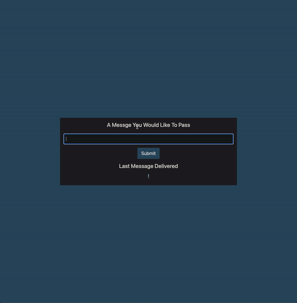

### Pass A Message

> JavaScript Hours, Minutes, Seconds countdown web app.

## Live Demo

Preview: https://pirci.github.io/pass-a-message/

## What I Learned:

- Practice **jQuery** with project.
- Using **bootstrap** in project.
- Using function **addEventListener()** method.
- Basic HTML and CSS structure & style.

## Possible Improvements

> Any type of suggestions/improvements to this repo are always welcome.
